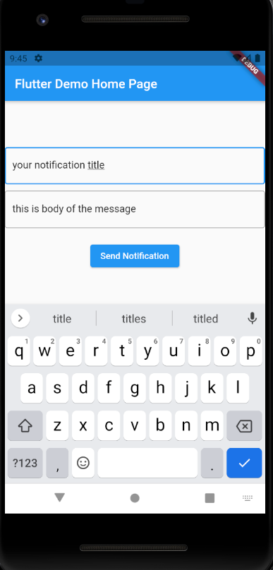

# flutter-push-notification
Push Notification sample using Spring Boot, Flutter &amp; Firebase

 

 ## Getting Started
 1. Change the ip address with your device ip address in `main.dart` line `18`
 2. Put your `google-services.json` in `mobile/android/app`
 3. Put your service account json in `backend/src/main/resources/firebase-service-account.json`
 4. Run Spring Boot and Flutter App simultaneously

## Reference Link
### Flutter
- https://www.freecodecamp.org/news/how-to-add-push-notifications-to-flutter-app/
- https://medium.com/firebase-tips-tricks/how-to-use-firebase-cloud-messaging-in-flutter-a15ca69ff292
- https://medium.com/nusanet/flutter-fcm-fc63914598db
- https://firebase.flutter.dev/docs/messaging/overview

### Spring Boot
- https://springhow.com/spring-boot-firebase-push-notification/
